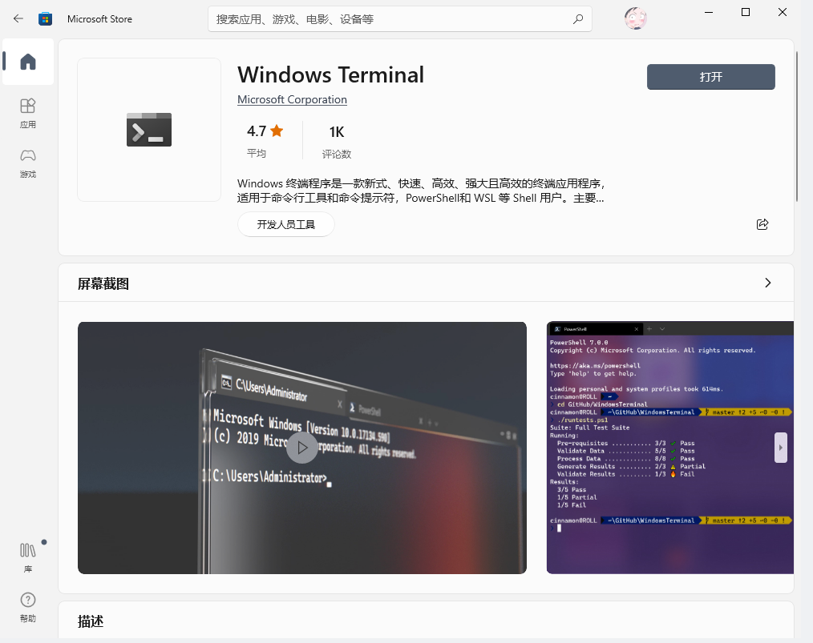
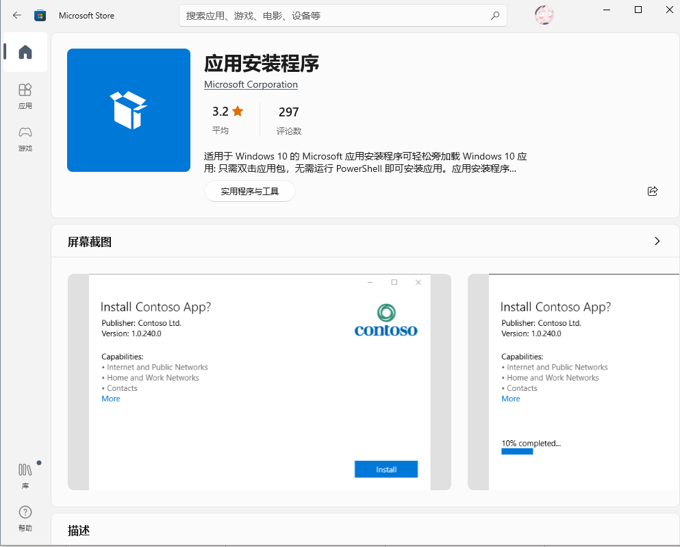
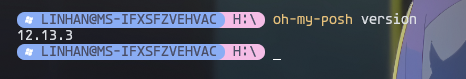

# Windows Terminal + Oh My Posh

利用 oh my posh 主题，将 windows 自带 terminal 装扮得更加炫酷一点，先看效果：


当然不同的主题会有不同的效果，更多效果：https://ohmyposh.dev/docs/themes
下面让我来带大家手摸手进行配置吧！

### Windows Terminal

- [GitHub - microsoft/terminal](https://github.com/microsoft/Terminal)

- 安装：microsoft store 搜索：windows terminal
- 



- 注册表添加右键启动：

```桌面新建 .bat 文件，输入以下内容，双击运行
reg add "HKCU\Software\Classes\Directory\shell\Open Fluent Terminal here\command" /d "\"%LOCALAPPDATA%\Microsoft\WindowsApps\flute.exe\" new \"%%V\"" /f
reg add "HKCU\Software\Classes\Directory\Background\shell\Open Fluent Terminal here\command" /d "\"%LOCALAPPDATA%\Microsoft\WindowsApps\flute.exe\" new \"%%V\"" /f
reg add "HKCU\Software\Classes\Drive\shell\Open Fluent Terminal here\command" /d "\"%LOCALAPPDATA%\Microsoft\WindowsApps\flute.exe\" new \"%%V\"" /f
reg add "HKCU\Software\Classes\LibraryFolder\Background\shell\Open Fluent Terminal here\command" /d "\"%LOCALAPPDATA%\Microsoft\WindowsApps\flute.exe\" new \"%%V\"" /f
```

### [Oh My Posh](https://ohmyposh.dev/docs/installation/prompt)
#### 安装```winget```
在microsoft store中：

#### 安装 oh-my-posh

```
# 可能需要外网，如果下载不成功，只能取 github 上下载 
winget install JanDeDobbeleer.OhMyPosh -s winget
```
- 下载完成后包含两个东西：
  - oh-my-posh.exe
  - 环境变量```POSH_THEMES_PATH```：后续 oh my posh 的主题配置文件都会在这里

- 查看是否安装成功：

#### 主题:
查看主题：
- 方式一：[官网](https://ohmyposh.dev/docs/themes)
- 方式二：执行命令 ```Get-PoshThemes```

设置主题
  - 每个主题都是一个 ```json```文件，所以只需要复制文件名即可，例如 ```M365Princess.omp.json```
  - 在配置文件中设置主题
  
    ```
    oh-my-posh init pwsh --config $env:POSH_THEMES_PATH\M365Princess.omp.json | Invoke-Expression
  
    # 此外, 要想切换到其他主题, 只需更改 json 即可, 所有的主题 json 文件都在环境变量下面
    oh-my-posh init pwsh --config $env:POSH_THEMES_PATH\bubbles.omp.json | Invoke-Expression
    ```
### Q&A
- Q1：出现乱码？
  
  A：没有用自定字体：[Nerd Fonts](https://www.nerdfonts.com/font-downloads)，安装后在power shell中指定字体，重启

- Q2：下次打开终端，配置好的主题又没了
  
  A：需要让终端启动时自动执行更换主题的脚本：
  
  ```
  # 1. 打开 power shell 脚本配置文件
  notepad $PROFILE
  # 2. 在配置文件里写入更换主题
  oh-my-posh init pwsh --config $env:POSH_THEMES_PATH\M365Princess.omp.json | Invoke-Expression
  # 3. 更换后手动保存
  . $PROFILE
  ```

- Q3：Q2 配置好后启动报错，没有权限执行脚本
  
  A：windows下运行`*.ps1`脚本（ powershell 的脚本）的时候，需要设置执行权限
  
  ```
  # 查看当前执行策略，原因就是当前策略为 Restricted ，不允许 powershell 启动运行脚本
  get-executionpolicy
  # 开放策略1：这种启动比较慢，需要远程加载
  set-executionpolicy remotesigned 
  # 开放策略2：较1快
  set-executionpolicy Unrestricted
  # 设置回去
  set-executionpolicy Restricted
  ```
